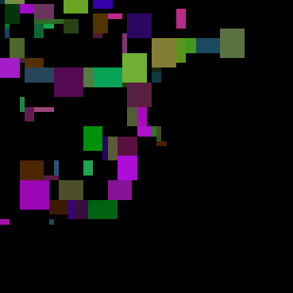
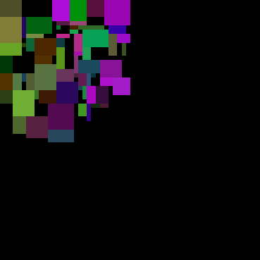
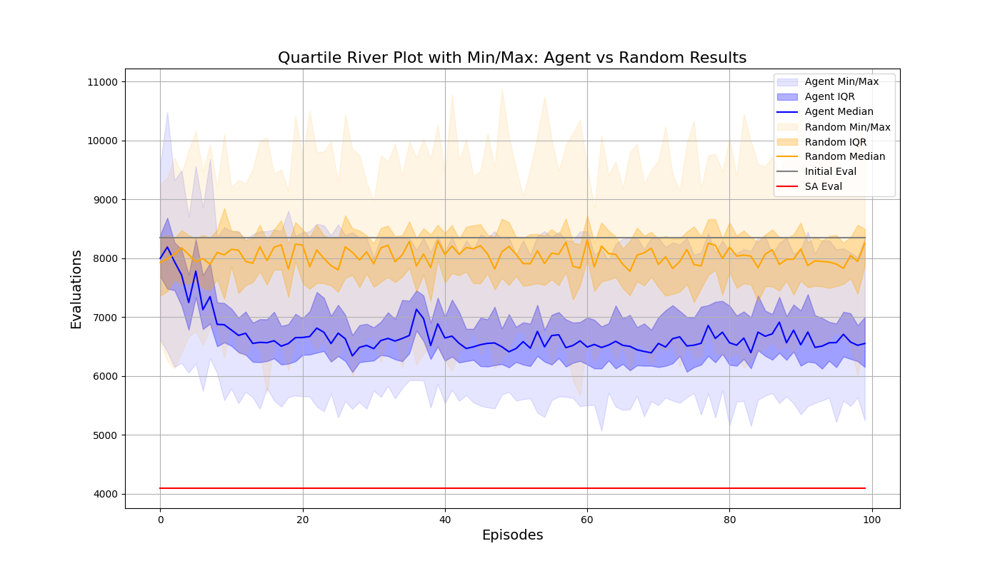
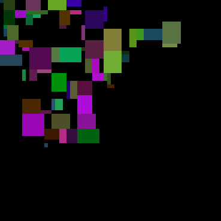
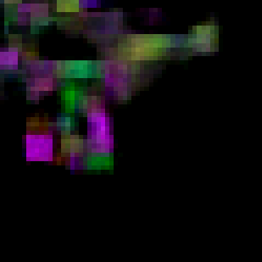
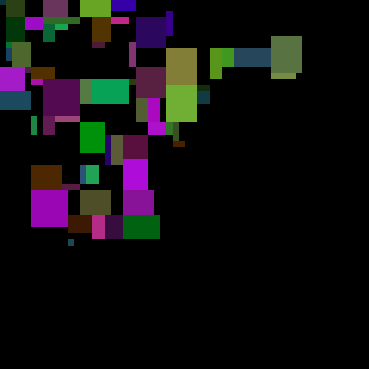

# Floorplanning with Reinforcement Learning
To run this project make sure to have rust and python installed, you will need to create a virtual environment, 
the recomended steps are the following:
 - Create a conda enviromnent and activate it
 - run:
   - ``` conda install python==3.12 ``` to get a version that works
   - ``` pip install -r rl_solver/requirements.txt ``` to install all dependencies
   - ``` maturin develop -r ``` to compile the rust code and create the python bindings, maturin should have been installed with the dependency installation
   - ``` python rl_solver/main.py ``` to execute the code
   - ``` python rl_solver/main.py 100 ``` to specify the number of components, by default is 64
   - ``` python rl_solver/plot_results.py ``` to plot the results from the execution
   
   <a/>
The main sequence pair code and local search algorithms are written in rust to leverage it's speed, and the reinforcement learning code is written\
python with tensorflow.\
To test the rust code use: ```cargo test```, the tests can be found in the file [domain.rs](src/domain.rs)\
The proposed program to execute creates a random floorplan with a specified number of components and executes a Simulated Annealing process\
with enough iterations to get a decent result, then the code runs 100 episodes where the ppo agent learns to make good moves with a 16 moves limit\
and it gets recorded to the files: [rand_results.csv](rand_results.csv)(for the random baseline) [results.csv](results.csv)(agent results), these results can be visualized using the plotting\
script. The results of the last execution are the following:

Initial random floorplan: 8345.5\


Simulated annealing solution: 4095\


Agent solution: 5070\


With the comparison with the random baseline:\


Here is the last output saved from the autoencoder:\



And the result from the move it chose:\
\
It's hard to notice but it swapped the positions of the two blue horizontal rectangles, doesn't seem like the best move.

The execution images get saved to [visualizations](visualizations)